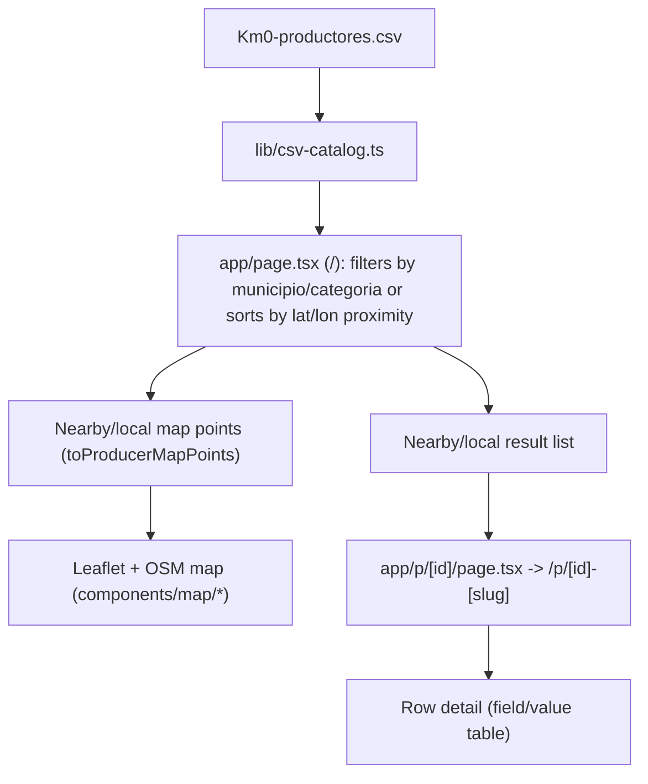

# Architecture

## Purpose
Serve `Km0-productores.csv` as a location-first producer discovery catalog with map + simple detail page.

## Runtime flow

## Components
- `lib/csv-catalog.ts`
  - Reads CSV with `csv-parse/sync`.
  - Normalizes text for search.
  - Reads coordinates (`lat/lon`) when present.
  - Exposes:
    - `searchProducers({ municipality, category, lat, lon })`
    - `listCategories()`
    - `listMunicipalitySummaries(category?)`
    - `findProducerById(id|id-slug)`
    - `toProducerMapPoints(rows)`
- `app/page.tsx`
  - Reads URL params `municipio`, `categoria`, `lat`, and `lon`.
  - Shows municipality input, location action, and category chips.
  - Shows a start screen with municipality suggestions on the default landing state.
  - Avoids rendering a full-catalog map on that default landing state.
  - With `lat/lon`, lists the closest producers with reliable map coordinates.
  - With `municipio`, lists matching local producers.
  - Renders a Leaflet map with OSM tiles for the visible local/nearby producers.
- `app/p/[id]/page.tsx`
  - Resolves one row by index.
  - Redirects legacy `/p/[id]` URLs to canonical `/p/[id]-[slug]`.
  - Renders all CSV columns and values.

## Design rules
- Keep one data source: CSV file on disk.
- Keep search logic centralized in `lib/csv-catalog.ts`.
- Keep pages thin and explicit.
- Avoid hidden side effects or caching outside current module boundaries.
