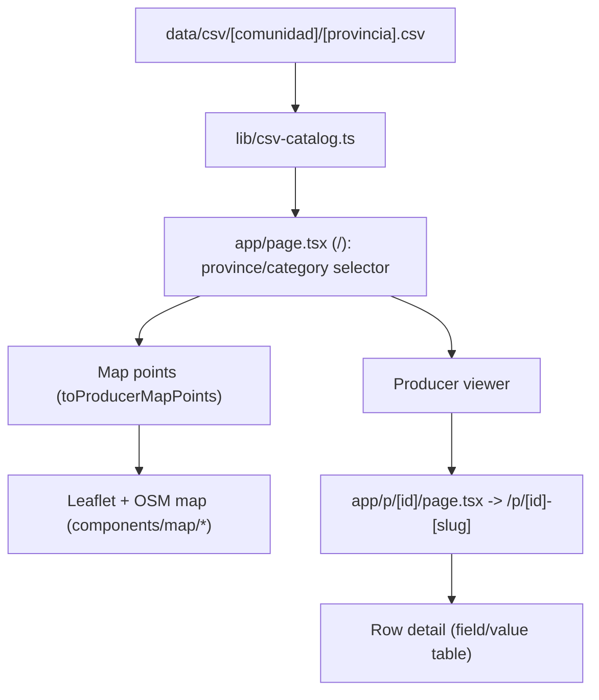

# Architecture

## Purpose
Serve province CSV files as a map-first producer catalog with a simple row detail page. Barcelona is the default and most complete catalog.

## Runtime flow

## Components
- `lib/csv-catalog.ts`
  - Reads CSV with `csv-parse/sync`.
  - Normalizes text for search.
  - Reads coordinates (`lat/lon`) when present and uses them for map points.
  - Keeps `direccion` as the human-readable location reference that should match those coordinates.
  - Exposes:
    - `searchProducers({ municipality, category, lat, lon })`
    - `listCategories()`
    - `listMunicipalitySummaries(category?)`
    - `findProducerById(id|id-slug)`
    - `toProducerMapPoints(rows)`
- `app/page.tsx`
  - Reads URL params `provincia`, `categoria`, and `destacar`.
  - Shows province selector and category chips.
  - Renders a Leaflet map with OSM tiles for producers with coordinates.
  - Renders a compact producer viewer next to the map.
- `app/p/[id]/page.tsx`
  - Resolves one row by index.
  - Redirects legacy `/p/[id]` URLs to canonical `/p/[id]-[slug]`.
  - Renders all CSV columns and values.

## Design rules
- Keep one data source per province: CSV file on disk, grouped by autonomous community.
- Keep CSV reading and normalization centralized in `lib/csv-catalog.ts`.
- Keep pages thin and explicit.
- Avoid hidden side effects or caching outside current module boundaries.
