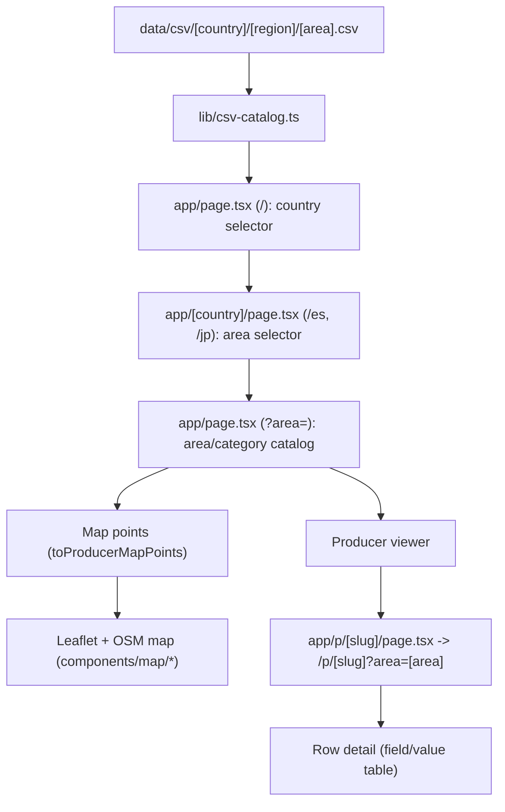
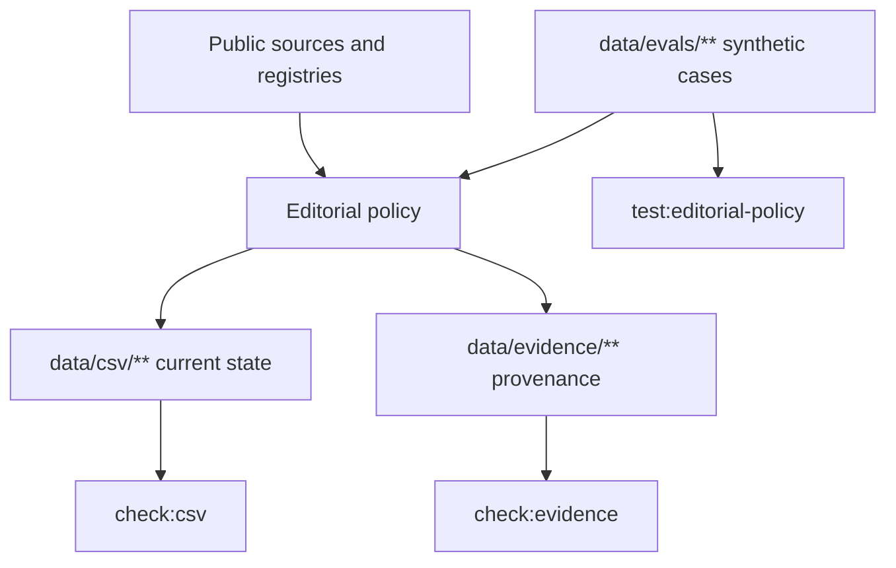

# Architecture

## Purpose
Serve area CSV files as a map-first producer catalog with a simple row detail page. The app has no implicit default area; `/` asks for a country and `/[country]` for an area before any CSV is read.

## Runtime flow

`data/evidence/**` and `data/evals/**` are editorial control inputs only. The
runtime does not read them, so provenance and policy validation cannot become a
hidden application data source.

## Editorial control flow

## Components
- `lib/csv-catalog.ts`
  - Reads CSV with `csv-parse/sync`.
  - Normalizes text for search.
  - Reads coordinates (`lat/lon`) when present and uses them for map points.
  - Keeps `direccion` as the human-readable location reference that should match those coordinates.
  - Exposes:
    - `searchProducers({ municipality, category, lat, lon })`
    - `listCategories()`
    - `listMunicipalitySummaries(category?)`
    - `findProducerBySlug(slug|legacy-id|legacy-id-slug)`
    - `toProducerMapPoints(rows)`
- `app/page.tsx`
  - Reads URL params `area`, `categoria`, and `destacar` (producer `slug`).
  - Renders the area chooser when `area` is missing or unknown.
  - Shows area selector and category chips.
  - Renders a Leaflet map with OSM tiles for producers with coordinates.
  - Renders a compact producer viewer next to the map.
- `app/p/[slug]/page.tsx`
  - Resolves one producer by current `slug` plus `area`.
  - Redirects legacy `/p/[id]` and `/p/[id]-[slug]` URLs to canonical `/p/[slug]?area=[area]`.
  - Redirects detail requests without `area` back to `/` because producer slugs are area-scoped.
  - Renders all CSV columns and values.

## Design rules
- Keep one data source per area: CSV file on disk, grouped by autonomous community.
- Keep decision provenance in matching JSONL evidence ledgers; never read them from application code.
- Keep stable editorial outcomes covered by synthetic evaluation cases.
- Keep CSV reading and normalization centralized in `lib/csv-catalog.ts`.
- Keep pages thin and explicit.
- Avoid hidden side effects or caching outside current module boundaries.
